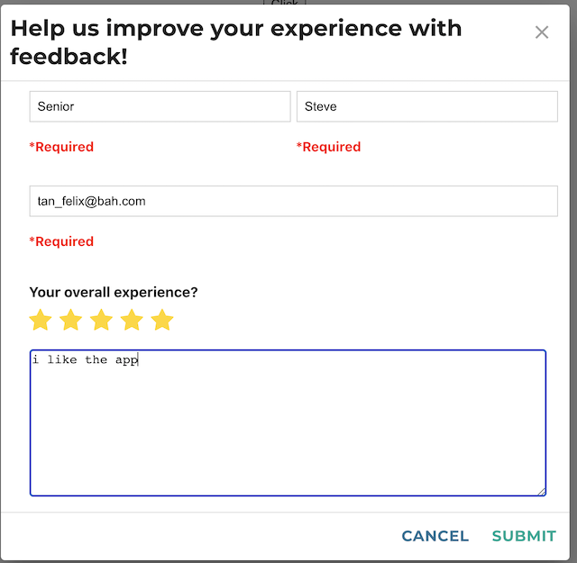

# advana-module-jira-feedback

This is the module that allows for a JIRA feedback modal that can be integrated in your app.

## Environment Variables

* REACT_APP_SUBMIT_FEEDBACK_ENDPOINT (example: http://localhost:8080/api/jira/feedback)
* REACT_APP_USE_WITH_CREDENTIALS (whether or not to use `withCredentials` for axios. Defaults to `true`)

## Example usage

REACT_APP_USE_WITH_CREDENTIALS=true REACT_APP_SUBMIT_FEEDBACK_ENDPOINT=http://localhost:8080/api/jira/feedback npm run start